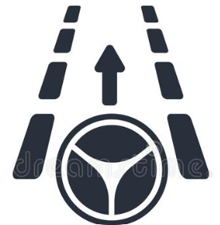
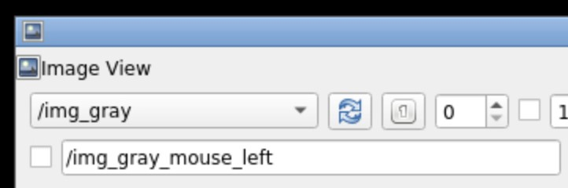

# CSCE482-483-931_22F-2A1

<!-- ## Team: 2A1. Traffic Object/Lane Detection -->

<!--  -->


<p align="center">
  <a>
    
  </a>
  <h3 align="center">2A1. Traffic Object/Lane Detection</h3>
  <!-- <p align="center">
    Mini Description Here...
  </p> -->
</p>

## About the Project
With autonomous vehicles on the rise, it is becoming important more than ever for their internal systems to be optimized. This project handles the integration of an object/lane detection model to the Robot Operating System [(ROS)](https://www.ros.org/). ROS is commonly used to program autonomous vehicles. The [HybridNets](https://github.com/datvuthanh/HybridNets) machine learning model was utilized for its joint detection capabilities and top performance.

### Objectives: 
* Evaluate existing detection framework on our dataset
* Integrate existing detection framework with ROS/ROS2
* Input: image, Output: bounding boxes/classification results


## Prerequisites
* Operating System: Mac, Linux, or Windows
* Docker [https://docs.docker.com/get-docker/](https://docs.docker.com/get-docker/)
* GitHub Account [https://github.com/join](https://github.com/join)


## Getting Started [Demo](https://youtu.be/RsVTSVPN9fc)
Clone the repository:

```bash
git clone --recursive https://github.com/tamu-edu-students/CSCE482-483-931_22F-2A1
cd CSCE482-483-931_22F-2A1
```

Build the latest Docker container from image. Building the image initally may take 15-30 minutes, depending on the speed of your internet and performance of machine.
```bash
make build
```

Lastly, download the bag file [16-mcity1.bag](https://drive.google.com/file/d/1wd52kaQGrDC4oLVAq-fCSeIch1_wm808/view?usp=sharing) and move it to the shared folder *rootfs/*


### Disclaimer: 
Unable to associate GitHub Docker Package to repository due to restrictions from tamu-edu-students organization. \
Docker Package can be found here:
[https://github.com/users/ojasonbernal/packages/container/package/2a1-package](https://github.com/users/ojasonbernal/packages/container/package/2a1-package)

## Usage
Run the latest Docker container from image
```bash
make init
```
Executing ```make init``` will then open the container Command-Line Interface (CLI). Make sure to run the command on both terminals as  this will be useful for the next steps.

Optional: If you already have a container named 2a1-package, then execute the following command to run the docker container
```bash
make run
```

***YOU MUST COMPLETE THESE STEPS EVERYTIME YOU RUN THE PROJECT*** \
Ensure to source the environment first in order for the project to run as intended.
Run the following commands to source the environment:
```bash
source /opt/ros/noetic/setup.bash
```
```bash
source rootfs/catkin_ws/devel/setup.bash
```

We need to change the directory to the catkin_ws to be able to compile using catkin_make.
```bash
cd rootfs/catkin_ws/
catkin_make
```


Once you have completed the above steps, you will be able to open up VNC. You will need to be in VNC to continue. \
You can view VNC through [http://localhost:6081/vnc.html](http://localhost:6081/vnc.html) \
You should enter "password" for the password.

It is best to have two terminals open to run the project. \
First execute the command in terminal 1:
```bash
source rootfs/catkin_ws/devel/setup.bash; (roscore &); rosbag play -r 10 --loop rootfs/16-mcity1.bag
```
The execution of the above command will make it so that the ROS node is sourced (this must be done in order to use ROS) and a small video will be played to test the model.


Then execute this command in terminal 2, in order to run the developed HybridNets node:
```bash
source rootfs/catkin_ws/devel/setup.bash; (rqt_image_view &); python3 /root/rootfs/catkin_ws/src/ros_basics_tutorials/scripts/image_subscriber.py
```
The above command will execute the Python ROS node which was created for joint detection of objects and lanes. 
The project is also publishing the bounding box information to be able to be received by another ROS node.


The processed video may not show up on the VNC instantly, it is recommened to refresh the topics to be able to view the processed video. The refresh button is located next to the selection of topics, as seen below. \


Open the *rootfs/* folder to find images that are being outputted showcasing the joint detection model.


You must be in the *rootfs/catkin_ws/* folder for this step. You can view the ROS messages for both the BoudingBox and BoudingBoxes by running the following command:
```bash
rosmsg show BoundingBox
```
```bash
rosmsg show BoundingBoxes
```

## Performance Testing
For testing, the team began by executing the [16-mcity1.bag](https://drive.google.com/file/d/1wd52kaQGrDC4oLVAq-fCSeIch1_wm808/view?usp=sharing) file on both the YOLO and HybridNets Machine Learning Models. \
In order for the team to obtain data on the performance of YOLO, the team utilized [Darknet-ROS](https://github.com/leggedrobotics/darknet_ros) as it uses the YOLO machine learning model. The team collected various data points on the performance differences between HybridNets and YOLO, as suggested below:

Metrics Observed: 
* Accuracy on Object Detection
* Frame Rate
* Completion Time of Model


## Benefits
The joint detection model is a great start to be able to optimize the performance of such lane and object detection models that exist today. As of late 2022, most ROS nodes only execute one detection model, whether that be object or lane detection, but only few models can do both and even less have been implemented with ROS. The aim of the project was to utilize open source software which is rich in documentation so that further development of this system can be accomplished and improved upon. The project accomplished the task of being able to implement a joint detection model (HybridNets) in ROS.

Metrics improved based on other models:
* Accuracy
* Usability
* Robustness

The Pipeline created can be visualized as:

*Images -> ROS -> HybridNets -> ROS*

The reason being that unprocessed images will be sent to ROS, whether as a .bag file or appropriate image file, which will then be processed using the HybridNets model and the bounding box information gathered will be sent back to ROS with the image unaltered as well. The use of ROS is critical as this will allow for use on multiple vehicles and the use of HybridNets is important due to the joint detection capabilities that is possesses.


## Contributors
Team Name: OLD482
* Pavan Poladi [https://github.com/pavanpoladi](https://github.com/pavanpoladi)
* Khai Nguyen [https://github.com/Khaihuyennguyen](https://github.com/Khaihuyennguyen)
* Viet Nguyen [https://github.com/vivelaviet](https://github.com/vivelaviet)
* Jason Bernal [https://github.com/ojasonbernal](https://github.com/ojasonbernal)


## Acknowledgements
* [HybridNets](https://github.com/datvuthanh/HybridNets)
* [Darknet-ROS](https://github.com/leggedrobotics/darknet_ros)
* [ROS-Docker-Intro](https://github.com/tamu-edu-students/ROS-Docker-Intro)


### Resources Used:
* Learn Docker in 7 Easy Steps - Full Beginner's Tutorial [https://www.youtube.com/watch?v=gAkwW2tuIqE](https://www.youtube.com/watch?v=gAkwW2tuIqE)
* ROS Tutorial 5 (ROS1) - Write a ROS Node with Python [https://www.youtube.com/watch?v=jWtkzDbez9M](https://www.youtube.com/watch?v=jWtkzDbez9M)
* How to setup ROS with Python 3 [https://medium.com/@beta_b0t/how-to-setup-ros-with-python-3-44a69ca36674](https://medium.com/@beta_b0t/how-to-setup-ros-with-python-3-44a69ca36674)
* https://www.freecodecamp.org/news/docker-cache-tutorial/


### Useful Commands  (For Development Purposes Only):
If a package already exists with the name 2a1-package, you can remove it using the following command:
```bash
make rm
```

If updating Dockerfile, use the following command to build your own image:
```bash
make build
```

To run docker container, use:
```bash
make run
```

You can also pull the latest Docker package using the following command:
```bash
docker pull ghcr.io/ojasonbernal/2a1-package:latest
```
